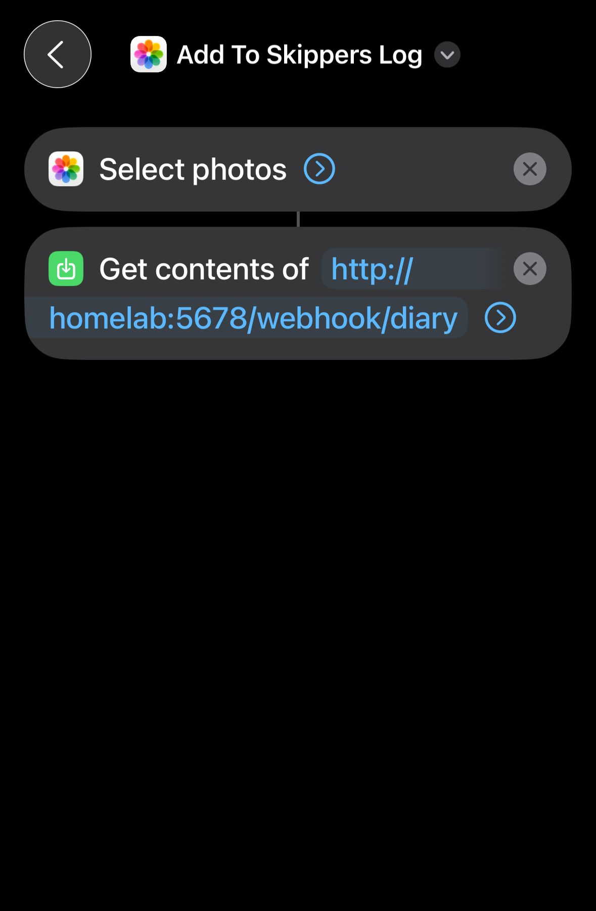

# n8n Holidays AI Showcase

Welcome to my n8n automation showcase! This repository documents a 15-minute demonstration of workflows I've built with **n8n**, a powerful self-hosted workflow automation platform enhanced with AI capabilities.

## 🤖 What is n8n?

**n8n** is an open-source, fair-code workflow automation platform that allows you to:

- **Connect 400+ applications and services** without coding expertise
- **Build complex automation workflows** with a visual interface
- **Self-host on your own infrastructure** for complete data privacy and control
- **Integrate with leading AI models** for intelligent automation
- **Create conditional logic, loops, and error handling** for robust workflows
- **Run locally or in the cloud** with full flexibility

Unlike cloud-only solutions, n8n gives you complete ownership of your data and workflows, making it ideal for sensitive operations and custom requirements.

## 🚀 Quick Start

To learn more about what I've built, check out the [full documentation](docs/index.md).

## ⚙️ Setup

This showcase uses n8n locally hosted on a mini PC. To run these workflows, you'll need:

- n8n installed locally ([Installation Guide](https://docs.n8n.io/hosting/installation/))
- Required integrations/credentials as documented in each workflow
- API keys for any AI models or external services used

## 📝 Documentation

- [Full Project Overview](docs/index.md)
- [Leading AI Models](#-leading-ai-models)
- [Learning Resources](#-learning-resources)

### Project 1: Digitize Diary Entry

**Transform handwritten diary entries into searchable digital text using AI vision and automation**

#### Overview

This workflow takes a photo of a handwritten diary entry from your physical notepad and automatically digitizes it into text using GPT-4 Vision. Triggered via an iOS Shortcut, it enables seamless capture and digitization without manual effort.

#### Key Features

- 📱 **iPhone Shortcut Integration** - Trigger the workflow from your phone's home screen
- 🤖 **AI Vision Processing** - Uses GPT-4 Vision to extract handwritten text with high accuracy
- 💾 **Automatic Storage** - Saves digitized entries to your preferred location
- ⚡ **Real-time Processing** - Fast turnaround from capture to digitized text
- 🔐 **Self-Hosted & Private** - Your diary entries stay on your own server

#### How It Works

1. **Trigger**: Tap the "Skipper's Log" shortcut on your iPhone
2. **Capture**: Take a photo of your diary entry from your notepad
3. **Send**: The image is sent to your self-hosted n8n instance
4. **Process**: GPT-4 Vision reads the handwritten text
5. **Store**: Digitized entry is saved and organized
6. **Notify**: You receive confirmation with the extracted text

#### Visual Overview

| Component | Screenshot |
|-----------|-----------|
| **iOS Shortcut** |  |
| **Handwritten Entry** |  |

#### Workflow Architecture

```
iPhone Shortcut
    ↓
Send Image → n8n Webhook
    ↓
GPT-4 Vision Analysis
    ↓
Extract & Format Text
    ↓
Store Result
    ↓
Send Confirmation
```

#### Technologies Used

- **n8n** - Workflow automation platform
- **GPT-4 Vision** - AI model for handwriting recognition
- **iOS Shortcuts** - Mobile trigger mechanism
- **Webhook** - Communication between iPhone and n8n

#### Use Cases

✅ Quick personal journaling without typing
✅ Creating searchable digital archives of handwritten notes
✅ Backup and preservation of diary entries
✅ Integration with other automation workflows
✅ Building a personal knowledge base

#### Benefits Over Manual Transcription

| Aspect | Manual | With Workflow |
|--------|--------|---------------|
| **Time** | 5-10 mins per entry | <30 seconds |
| **Accuracy** | Human error prone | 95%+ accuracy |
| **Consistency** | Variable formatting | Standardized |
| **Friction** | High (typing required) | Low (one tap) |
| **Integration** | Not possible | Integrates with other workflows |

---


## 🧠 Leading AI Models

Here are some of the most powerful AI models that can be integrated with n8n:

### Large Language Models (LLMs)

| Model | Provider | Use Cases | Free Tier |
|-------|----------|-----------|-----------|
| **GPT-4o** | OpenAI | Advanced reasoning, complex tasks, high accuracy | Paid |
| **Claude 3.5 Sonnet** | Anthropic | Long context, coding, analysis, safety-focused | Paid |
| **Llama 2 / 3** | Meta | Open-source, customizable, cost-effective | Yes (Open) |
| **Mistral Large** | Mistral AI | Fast, efficient, competitive with GPT-4 | Paid |
| **Gemini Pro** | Google | Multimodal, competitive pricing, good integration | Paid |

### Vision & Multimodal Models

| Model | Provider | Capabilities |
|-------|----------|--------------|
| **GPT-4 Vision** | OpenAI | Image understanding, OCR, visual analysis |
| **Claude 3 Vision** | Anthropic | Advanced image understanding, detailed analysis |
| **Gemini Pro Vision** | Google | Multimodal with excellent vision capabilities |

### Specialized Models

| Category | Models | Use Cases |
|----------|--------|-----------|
| **Embedding** | OpenAI, Cohere, HuggingFace | Semantic search, similarity matching |
| **Speech** | Whisper, ElevenLabs | Voice-to-text, text-to-speech |
| **Code** | GitHub Copilot, Claude | Code generation, debugging, refactoring |

### How to Use with n8n

1. Create API accounts for your chosen models
2. Add credentials in n8n (Settings → Credentials)
3. Drag AI nodes into your workflows
4. Configure prompts and parameters
5. Chain with other workflow steps for automation

## 📚 Learning Resources

### YouTube Channels & Playlists

- **[n8n Official Channel](https://www.youtube.com/@n8n_io)** - Tutorials, releases, best practices
- **[Giovanni Brouwer](https://www.youtube.com/@GiovanniBrouwer)** - In-depth n8n tutorials and advanced workflows
- **[Workflow Automation with n8n](https://www.youtube.com/results?search_query=n8n+tutorials)** - Community-created content
- **[OpenAI & LLM Integration](https://www.youtube.com/results?search_query=OpenAI+API+tutorial)** - AI model integration guides
- **[AI & Automation](https://www.youtube.com/@Fireship)** - Fireship for quick AI/automation overviews

### Documentation & Guides

- **[n8n Official Docs](https://docs.n8n.io/)** - Comprehensive documentation
- **[n8n Community](https://community.n8n.io/)** - Forums and support
- **[OpenAI API Docs](https://platform.openai.com/docs/)** - GPT and Vision models
- **[Anthropic Claude Docs](https://docs.anthropic.com/)** - Claude model documentation
- **[Google Gemini API](https://ai.google.dev/)** - Gemini integration guides

### Hands-On Projects

1. **Chat Applications** - Build AI chatbots integrated with n8n
2. **Data Processing** - Automate data extraction, transformation, and enrichment
3. **Content Generation** - Create, summarize, and translate content automatically
4. **Customer Support** - AI-powered ticket routing and response generation
5. **Scheduled Reports** - Generate insights and email reports periodically

---

*Last updated: December 2025*
